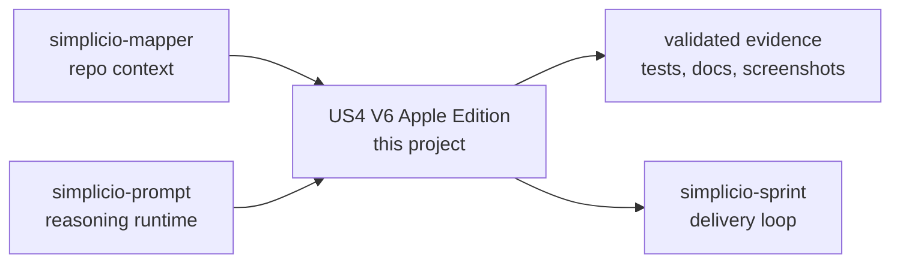

<h1 align="center">US4 V6 Apple Edition</h1>

<p align="center">
  <strong>Universal State Runtime for local LLM inference on Apple Silicon: MLX, Metal, NEON, ANE pathing and a practical CLI.</strong><br />
  <em>Commands stay in English so they can be copied exactly.</em>
</p>

<p align="center">
<a href="https://github.com/wesleysimplicio/ds4-simplicio-apple-v6/stargazers"></a>


</p>

<p align="center">
<a href="README.md">English</a> | <a href="READMEs/README.pt-BR.md">Português</a> | <a href="READMEs/README.es-ES.md">Español</a> | <a href="READMEs/README.ja-JP.md">日本語</a> | <a href="READMEs/README.ko-KR.md">한국어</a> | <a href="READMEs/README.zh-CN.md">简体中文</a> | <a href="READMEs/README.it-IT.md">Italiano</a> | <a href="READMEs/README.fr-FR.md">Français</a> | <a href="READMEs/README.ru-RU.md">Русский</a> | <a href="READMEs/README.pl-PL.md">Polski</a> | <a href="READMEs/README.hi-IN.md">हिन्दी</a> | <a href="READMEs/README.ar-SA.md">العربية</a> | <a href="READMEs/README.he-IL.md">עברית</a> | <a href="READMEs/README.ms-MY.md">Bahasa Melayu</a> | <a href="READMEs/README.id-ID.md">Bahasa Indonesia</a>
</p>

<p align="center">
  
</p>

---

## The short version

Universal State Runtime for local LLM inference on Apple Silicon: MLX, Metal, NEON, ANE pathing and a practical CLI.

## Project DNA

us4-v6-simplicio-apple is the desktop packaging edge of the ecosystem: native launchers, bootstrap scripts, CMake/package metadata, and the Apple-facing path for a local Simplicio experience. The refreshed README now keeps the global polish while preserving the practical installation and build notes from the earlier guide.

The new first screen is the doorway; the restored guide below is the workshop. This README should help a stranger understand the promise quickly and still give an operator enough depth to run, validate, and extend the project.

## Quick Start

```bash
brew install cmake ninja node
npm ci
cmake -S . -B build -G Ninja -DCMAKE_BUILD_TYPE=Release
cmake --build build --config Release
node bin/us4-cli.js probe --json
```

## What it does

- Local-first runtime path for Apple Silicon inference experiments.
- CMake + Ninja build with CLI smoke flows.
- Ollama/custom upstream serve path for practical chat backends.
- Unified product wrapper for `doctor`, `plan`, `convert`, `chat`, and `serve`.
- Runtime docs for MLX, Metal, scheduler, memory, cache and benchmarks.

## Why this README is built to earn attention

- clear first-screen promise
- language links before installation
- badges and a visual hero for fast trust
- copy-ready quick start
- proof before long reference material
- star history for social proof

## How it works



## Proof and validation

- Changelog tracks CMake project version and starter package version separately.
- Playwright CLI smoke tests are the high-signal E2E path.
- Repo currently resolves on GitHub as wesleysimplicio/ds4-simplicio-apple-v6.

## Simplicio ecosystem

- [simplicio-mapper](https://github.com/wesleysimplicio/simplicio-mapper) supplies repo context before interpretation.
- [simplicio-cli](https://github.com/wesleysimplicio/simplicio-dev-cli) executes focused code tasks with verification.
- [simplicio-prompt](https://github.com/wesleysimplicio/simplicio-prompt) provides fan-out and consensus runtime patterns.
- [simplicio-sprint](https://github.com/wesleysimplicio/simplicio-sprint) turns cards into draft PR delivery loops.

## Documentation standard

- [runtime/README.md](runtime/README.md)
- [CHANGELOG.md](CHANGELOG.md)
- [docs/readme-globalization-standard.md](docs/readme-globalization-standard.md)

## Original Field Guide

The section below restores the project-specific README material that existed before the globalization pass. Keep this substance when refreshing the top-level narrative: add polish, do not erase operational memory.

> Universal State Runtime for local LLM inference on Apple Silicon.
> EN. Versao pt-BR: [README.pt-BR.md](README.pt-BR.md).


### Run Locally

This is the shortest path to clone, build, run, and validate the project on a local machine.


#### 1. Clone

```bash
git clone https://github.com/wesleysimplicio/us4-v6-simplicio-apple.git
cd us4-v6-simplicio-apple
```

#### 2. Install Tooling

Minimum tools:

- Node.js 16.7 or newer
- npm
- CMake 3.27 or newer
- Ninja
- a C++20 compiler

Recommended on macOS:

```bash
xcode-select --install
brew install cmake ninja node
npm ci
npx playwright install
```

Recommended on Windows:

```powershell
npm ci
npx playwright install
```

On Windows, run native CMake commands from a Visual Studio Developer shell when available.

#### 3. Configure And Build

macOS/Linux:

```bash
cmake -S . -B build -G Ninja -DCMAKE_BUILD_TYPE=Release
cmake --build build --config Release
```

Windows PowerShell:

```powershell
cmake -S . -B build -G Ninja -DCMAKE_BUILD_TYPE=Release
cmake --build build --config Release
```

If Ninja is not available, CMake may use your platform default generator. Keep the same `build` directory.

#### 4. Run The CLI

Product wrapper:

```bash
node bin/us4-cli.js doctor --help
node bin/us4-cli.js plan --help
node bin/us4-cli.js convert --help
node bin/us4-cli.js chat --build
node bin/us4-cli.js probe --json
```

macOS/Linux:

```bash
./build/apps/us4-cli --probe
./build/apps/us4-cli run --model qwen-0.5b --prompt "hi" --max-tokens 8
./build/apps/us4-cli run --model qwen-0.5b --prompt "hi" --max-tokens 8 --json
```

Windows PowerShell:

```powershell
.\build\apps\us4-cli.exe --probe
.\build\apps\us4-cli.exe run --model qwen-0.5b --prompt "hi" --max-tokens 8
.\build\apps\us4-cli.exe run --model qwen-0.5b --prompt "hi" --max-tokens 8 --json
```

Useful model fixture examples:

```bash
./build/apps/us4-cli run --model-path tests/fixtures/models/qwen-0.5b/model.us4manifest --prompt "hi" --json
./build/apps/us4-cli run --model-path tests/fixtures/models/llama-3.1-8b --prompt "hello" --json
./build/apps/us4-cli run --model-path tests/fixtures/models/bitnet-b1.58-2b/model.us4manifest --backend neon --prompt "tiny" --json
```

#### 5. Validate Everything


Run the fast JavaScript gates:

```bash
npm run lint
npm test -- --coverage
npm run pack:dry
```

Run native build and regression:

```bash
cmake --build build --config Release
ctest --test-dir build --output-on-failure -C Release
```

Run CLI E2E evidence:

```bash
npx playwright test --reporter=list,html tests/e2e/us4-cli.spec.ts
```

Run benchmark evidence:

macOS/Linux:

```bash
./build/runtime/benchmarks/dense_baseline
./build/runtime/benchmarks/matrix_runner
```

Windows PowerShell:

```powershell
.\build\runtime\benchmarks\dense_baseline.exe
.\build\runtime\benchmarks\matrix_runner.exe
```

#### 6. Serve OpenAI-Compatible Endpoint (Local LLM, Ollama-Compatible)

US4 V6 ships an OpenAI-shape HTTP endpoint that drop-in replaces Ollama for
any client expecting `/v1/chat/completions`, `/v1/completions`, `/v1/models`,
or `/v1/embeddings`. Chat is served by `mlx_lm.server` (managed child
process); embeddings are served in-process by `mlx-embeddings`. Single-file
Python sidecar at `scripts/openai_serve.py`. No FastAPI, no uvicorn.

Two ways to run it: the **Python sidecar directly** (no C++ build required —
fastest path, recommended for local LLM use) or the **C++ CLI wrapper**
(`us4-cli serve`, identical contract once the native build exists).

##### 6.1 Python sidecar (recommended — no C++ build)

One-time setup. Use a project venv to avoid `externally-managed-environment`
on Homebrew Python:

```bash
python3 -m venv .venv
.venv/bin/pip install -r scripts/requirements-serve.txt
```

Run with defaults (chat + embeddings, bind `127.0.0.1:8080`, child mlx-lm on
`8081`). Always invoke the venv interpreter explicitly — `python3` from the
system PATH will not see MLX:

```bash
.venv/bin/python scripts/openai_serve.py
```

When running the Python sidecar directly, configure it with environment
variables:

| Env var | Default | Meaning |
|---|---|---|
| `US4_SERVE_HOST` | `127.0.0.1` | bind address |
| `US4_SERVE_PORT` | `8080` | public port (mlx-lm child uses `PORT + 1`) |
| `US4_SERVE_CHAT_BACKEND` | `mlx` | chat upstream selector — `mlx`, `ollama`, or custom |
| `US4_SERVE_CHAT_UPSTREAM` | unset | override upstream base URL (e.g. `http://127.0.0.1:11434`) |
| `US4_SERVE_CHAT_MODEL` | `mlx-community/Qwen2.5-Coder-7B-Instruct-4bit` (or `openbmb/minicpm5:latest` when backend=ollama) | chat model id |
| `US4_SERVE_EMBED_MODEL` | `mlx-community/embeddinggemma-300m-bf16` | embedding model id |
| `US4_SERVE_DISABLE_CHAT` | unset | set `1` to disable chat backend |
| `US4_SERVE_DISABLE_EMBED` | unset | set `1` to disable embeddings backend |
| `US4_SERVE_LOG_LEVEL` | `INFO` | `DEBUG` / `INFO` / `WARNING` / `ERROR` |
| `US4_SERVE_PROMPT_CACHE_BYTES` | unset | cap KV/prompt cache bytes on the `mlx_lm.server` child (e.g. `268435456` = 256 MiB). Only honoured when `CHAT_BACKEND=mlx`. |
| `US4_SERVE_MLX_EXTRA_ARGS` | unset | extra argv appended to `mlx_lm.server` (shell-style split). Escape hatch for any flag not exposed individually, e.g. `"--max-tokens 256 --prefill-step-size 512"`. Only honoured when `CHAT_BACKEND=mlx`. |

Example: pick a smaller 3B chat model on a memory-constrained M1 8 GB:

```bash
US4_SERVE_CHAT_MODEL=mlx-community/Qwen2.5-Coder-3B-Instruct-4bit \
US4_SERVE_PORT=8080 \
.venv/bin/python scripts/openai_serve.py
```

First start downloads model weights from HuggingFace into
`~/.cache/huggingface/` (7B 4-bit MLX ≈ 4 GB, 3B 4-bit ≈ 1.7 GB). Subsequent
starts reuse the cache.

Example: front an already-running Ollama daemon (chat goes through Ollama,
embeddings stay MLX-local). Useful when you want to reuse models already
pulled into Ollama without re-downloading the MLX variant from HuggingFace:

```bash
# 1) make sure Ollama is up and the model is pulled
ollama serve &                        # or launch the Ollama.app
ollama pull openbmb/minicpm5:latest

# 2) point us4-v6 at the Ollama daemon as its chat upstream
US4_SERVE_CHAT_BACKEND=ollama \
US4_SERVE_CHAT_MODEL=openbmb/minicpm5:latest \
.venv/bin/python scripts/openai_serve.py
```

Wire diagram in this mode:

```text
client ─► 127.0.0.1:8080 (us4-v6 OpenAI shape)
              ├─► /v1/chat/completions  ──► 127.0.0.1:11434 (Ollama)
              └─► /v1/embeddings         ──► in-process mlx-embeddings
```

This mode is what you want when:

- you already use Ollama for model management (`ollama pull`, `ollama list`,
  `ollama rm`) and only need the OpenAI-shape facade in front;
- you want one model server (Ollama) shared with other tools (Open WebUI,
  Cursor, Continue, etc.) but a *single endpoint* to point clients at;
- you are validating us4-v6 contract behaviour but the target machine cannot
  load both Ollama and an MLX child at once.

Add `US4_SERVE_DISABLE_EMBED=1` to skip the MLX embeddings backend entirely
if you only need chat — this saves the 300 MB embedding model load and a
chunk of resident RAM on small machines.

Example: native 7B chat on an M1 8 GB box with RAM-tuned MLX (3-bit quant +
capped KV cache). This is the recipe to use when you want 7B-class quality
on a small machine **without** falling back to the Ollama proxy:

```bash
US4_SERVE_CHAT_BACKEND=mlx \
US4_SERVE_CHAT_MODEL=mlx-community/Qwen2.5-Coder-7B-Instruct-3bit \
US4_SERVE_PROMPT_CACHE_BYTES=268435456 \
US4_SERVE_DISABLE_EMBED=1 \
.venv/bin/python scripts/openai_serve.py
```

Why this works on 8 GB:

- 3-bit MLX weights land at ~3.1 GB on disk and roughly the same resident
  in unified memory (vs ~4.5 GB for 4-bit, vs ~5.5 GB for Q4 GGUF in Ollama).
- `US4_SERVE_PROMPT_CACHE_BYTES=268435456` caps the KV cache at 256 MiB so a
  long prompt cannot balloon resident RAM past the safe envelope.
- `US4_SERVE_DISABLE_EMBED=1` skips the 300 MB embedding model load.

Measured on M1 8 GB with the recipe above:

| Path | Model | Latency (80 tok, T=0) | Throughput |
|---|---|---|---|
| us4-v6 native MLX 3-bit | `Qwen2.5-Coder-7B-Instruct-3bit` | ~16 s | ~5 tok/s |
| us4-v6 → Ollama proxy | `openbmb/minicpm5:latest` | not remeasured | not remeasured |

Native MLX is ~43 % faster on the same box because weights stay in unified
memory and the KV cache cap prevents swap thrash. Use this mode when you
want one binary, no daemon, and the smallest possible RAM footprint.

Need an even tighter ceiling? Combine with `US4_SERVE_MLX_EXTRA_ARGS` to
clamp generation and prefill chunking:

```bash
US4_SERVE_CHAT_BACKEND=mlx \
US4_SERVE_CHAT_MODEL=mlx-community/Qwen2.5-Coder-7B-Instruct-3bit \
US4_SERVE_PROMPT_CACHE_BYTES=134217728 \
US4_SERVE_MLX_EXTRA_ARGS="--max-tokens 256 --prefill-step-size 512" \
US4_SERVE_DISABLE_EMBED=1 \
.venv/bin/python scripts/openai_serve.py
```

##### 6.2 C++ CLI wrapper (after `cmake --build`)

Identical contract; `us4-cli serve` shells out to the same Python sidecar
with CLI flag → env var translation:

```bash
./build/apps/us4-cli serve

./build/apps/us4-cli serve \
  --chat-model mlx-community/Qwen2.5-Coder-7B-Instruct-4bit \
  --embed-model mlx-community/embeddinggemma-300m-bf16

./build/apps/us4-cli serve \
  --chat-backend ollama \
  --chat-upstream http://127.0.0.1:11434 \
  --chat-model openbmb/minicpm5:latest

./build/apps/us4-cli serve --no-chat            # embeddings only
./build/apps/us4-cli serve --no-embed --port 8088
```

##### 6.2.1 Native mode (`--native`) vs the proxy above

`us4-cli serve` (no flag) is the **proxy** mode described above: it shells
out to `scripts/openai_serve.py`, which drives a real `mlx_lm.server` or
Ollama child process — real inference, but not this repo's own runtime
engine.

`us4-cli serve --native` is a different, self-contained mode: a minimal
HTTP server implemented directly in this runtime (`runtime/net/`) that
answers `GET /v1/models` and `POST /v1/chat/completions` straight from the
adapter registry's `Generate()` pipeline — no external process, no Python.
It accepts an OpenAI-shaped body plus one extension field, `model_path`,
to point at a real `.safetensors`/`.gguf`/`.us4manifest` asset the same way
`us4-cli run --model-path` does; the response's `used_real_weights` field
reports whether that asset's real weights actually drove the output (see
issues #81.2/#81.4/#81.5) or the runtime fell back to its synthetic path.

```bash
./build/apps/us4-cli serve --native --port 8080

curl -s http://127.0.0.1:8080/v1/models

curl -s -X POST http://127.0.0.1:8080/v1/chat/completions \
  -H "Content-Type: application/json" \
  -d '{"model":"qwen-0.5b","model_path":"/path/to/model.safetensors",
       "messages":[{"role":"user","content":"hi"}],"max_tokens":16}'
```

It is intentionally simple: single-threaded, one request at a time, no
TLS, no auth — a correctness/contract server for issue #81.10, not a
production-concurrency one. Performance benchmarking of the native path
against Metal/MLX acceleration is blocked by the same missing macOS/Apple
Silicon hardware as issue #81.5; what's verified here is functional
correctness (see `tests/e2e/us4-cli-serve.spec.ts`), not throughput.

Native mode now also emits OpenAI-style SSE frames when the request body sets
`"stream": true`, and both native/proxy serve paths answer browser CORS
preflight requests so `apps/web-chat/` can talk to the local endpoint from a
different port without a custom reverse proxy.

##### 6.2.2 Web chat operator flow

The repo ships a React/Vite operator UI under `apps/web-chat/`:

```bash
node bin/us4-cli.js chat
```

Point it at `http://127.0.0.1:8080/v1` after starting either:

```bash
node bin/us4-cli.js serve
node bin/us4-cli.js serve --native
```

##### 6.3 Smoke test the endpoint

Once the server logs `us4 serve starting (host=127.0.0.1 port=8080 ...)`:

```bash
# liveness + model registry
curl -s http://127.0.0.1:8080/health
curl -s http://127.0.0.1:8080/v1/models

# chat (replaces `ollama run <model>` style usage)
curl -s http://127.0.0.1:8080/v1/chat/completions \
  -H 'Content-Type: application/json' \
  -d '{
    "model":"openbmb/minicpm5:latest",
    "messages":[{"role":"user","content":"fizzbuzz in python"}]
  }'

# embeddings (replaces `ollama embed`)
curl -s http://127.0.0.1:8080/v1/embeddings \
  -H 'Content-Type: application/json' \
  -d '{"input":"vector me"}'
```

##### 6.4 Point any OpenAI-shape client at the local endpoint

```bash
export OPENAI_BASE_URL=http://127.0.0.1:8080/v1
export OPENAI_API_KEY=anything
# any OpenAI SDK / langchain / litellm / continue.dev now hits us4-v6 locally
```

`simplicio-cli` consumes the same env vars:

```bash
export SIMPLICIO_BASE_URL=http://127.0.0.1:8080/v1
export OPENAI_API_KEY=anything
simplicio task "explain this diff" --stack generic --target README.md
```

##### 6.5 Hardware sizing on Apple Silicon

The us4-v6 MLX path is unified-memory aware: 4-bit MLX weights occupy real
RAM only once and are shared between CPU and GPU without copies. Compared
to GGUF/Ollama on the same Apple Silicon machine, RAM headroom is meaningful
on small machines:

| Machine | Comfortable chat model (Q4 MLX) | Tight ceiling |
|---|---|---|
| M1 / M2 8 GB | 0.5B–3B (`Qwen2.5-Coder-3B-Instruct-4bit`) or 7B 3-bit MLX with KV cache cap (see recipe above) | 7B Q4 (4.5 GB active, watch swap) |
| M1 / M2 / M3 16 GB | 7B Q4 (`Qwen2.5-Coder-7B-Instruct-4bit`) | 13B Q4 |
| M-series Pro/Max 32 GB | 13B–14B Q4 | 32B Q4 |
| M3/M4 Max 64 GB+ | 32B–70B Q4 | 70B Q5/Q6 |

Override `US4_SERVE_CHAT_MODEL` to match the box you are on. Pulling a 7B
model on an 8 GB machine is feasible but expect macOS to swap under load —
prefer a 3B for sustained chat.

##### 6.6 Troubleshooting

| Symptom | Cause | Fix |
|---|---|---|
| `mlx-embeddings is not installed` | Running `python3` from system PATH, not the venv | Use `.venv/bin/python scripts/openai_serve.py` |
| `error: externally-managed-environment` on `pip install` | Homebrew Python blocks system installs | Use the venv: `python3 -m venv .venv && .venv/bin/pip install -r scripts/requirements-serve.txt` |
| `OSError: [Errno 48] Address already in use` | Previous serve still bound to `8080` / `8081` | `lsof -nP -iTCP:8080,8081 -sTCP:LISTEN`, then `kill <pid>` |
| `command not found: ./build/us4-cli` | Native binary not built | Either `cmake --build build` first, or use the Python sidecar (section 6.1) |
| `--model ollama/...` flag ignored | Sidecar reads env vars only, no argparse | Set `US4_SERVE_CHAT_MODEL=...` instead |
| Beachball / swap thrashing on 7B chat | Machine RAM too small for chosen model | Drop to a 3B model (see hardware table in 6.5) |
| `chat upstream unreachable: Connection refused` with `backend=ollama` | Ollama daemon not running | `ollama serve &` (or launch the Ollama.app), then verify with `curl http://127.0.0.1:11434/api/tags` |
| Ollama returns `model "<id>" not found` | Model not pulled into Ollama | `ollama pull openbmb/minicpm5:latest` (or whatever `US4_SERVE_CHAT_MODEL` points at) |
| 7B chat OOM-kills the `mlx_lm.server` child on an 8 GB box | KV cache grew past safe envelope | Switch to the 3-bit quant + `US4_SERVE_PROMPT_CACHE_BYTES=268435456` recipe in 6.1, and add `US4_SERVE_DISABLE_EMBED=1` |
| `invalid US4_SERVE_MLX_EXTRA_ARGS` in serve log | Shell-quoting broke during env-var expansion | Wrap the whole value in double quotes, e.g. `US4_SERVE_MLX_EXTRA_ARGS="--max-tokens 256"` |
| `ignoring blocked tokens in US4_SERVE_MLX_EXTRA_ARGS` in serve log | You tried to override `--host`, `--port`, or `--cors*` via the escape hatch. Network binding is fixed to `127.0.0.1` by us4-v6 to prevent accidental exposure on shared/cloud hosts. | Drop those tokens. If you really need a different bind address, change `US4_SERVE_HOST` (still localhost-validated) instead of smuggling through extra args. |
| `ignoring US4_SERVE_PROMPT_CACHE_BYTES=...: expected a positive integer` | Value is not numeric (e.g. `512m`, `256MB`) | Use a raw byte count: `268435456` for 256 MiB, `536870912` for 512 MiB |

Full contract (endpoints, request/response shapes, env knobs, exit codes,
security posture) lives in [`.specs/runtime/SERVE-OPENAI.md`](.specs/runtime/SERVE-OPENAI.md).

#### What "Working" Looks Like

- `us4-cli --probe` prints hardware/runtime capability information.
- `us4-cli run ...` prints generated fixture tokens and explicit backend telemetry.
- `ctest` reports all configured native tests passing.
- Playwright reports all CLI smoke tests passing and writes evidence to `playwright-report/` and `test-results/`.
- `dense_baseline` prints benchmark rows with requested backend, observed backend, fallback status, token count, and correctness placeholders where external references are not wired.

If GoogleTest is not installed locally, CMake still builds the smoke and native contract runner tests and prints a warning that GTest-specific tests were skipped.

### What This Repo Is

This repository contains the **US4 V6 Apple Edition** local runtime scaffold and implementation plan, plus the native C++ runtime slices built across the sprint plan.

Today the repo contains:

1. the **llm-project-mapper/bootstrap layer** used to scaffold disciplined AI-assisted work;
2. the **project plan** under `.specs/`;
3. the native runtime scaffold under `runtime/`;
4. the CLI under `apps/cli`;
5. unit, native contract, Playwright, and benchmark evidence paths.

Reference source: [US4-V6-simplicio.md](US4-V6-simplicio.md).

### Product scope

US4 V6 Apple Edition targets local inference for:

- dense adapters: Qwen, Llama, Gemma;
- MoE adapters: DeepSeek, Kimi, MiniMax, GLM;
- low-memory adapters: BitNet and PT-BitNet ternary;
- Apple backends: MLX, Metal, NEON/Accelerate, and optional ANE on M5+.

The product is explicitly:

- single-machine first;
- correctness-gated before performance claims;
- CLI + library, not a GUI app;
- Apple-specific in this edition.

### Current Repo Status

**Planning and runtime scaffold are now present at the project level.**

- Product docs define vision, domain, personas, runtime modes, and compatibility targets.
- Architecture docs define the runtime boundaries, contracts, and coding patterns for C++/Metal/MLX work.
- Workflow docs define how implementation moves through task, DoD, PR, and release gates.
- Runtime code, CLI, fixtures, benchmarks, and E2E tests are present.
- GitHub issues are synchronized with the local sprint task files.

### Stack

- C++20 + CMake + Ninja
- MLX as primary tensor/runtime path on Apple Silicon
- Metal for measured hot kernels not well covered by MLX
- NEON / Accelerate as CPU fallback
- ANE as opt-in offload path on M5+
- GoogleTest + CTest for unit and regression
- Playwright for CLI E2E evidence

### Working model

The repo follows the `AGENTS.md` ecosystem. Core instructions live in:

- [AGENTS.md](AGENTS.md)
- [CLAUDE.md](CLAUDE.md)
- [.github/copilot-instructions.md](.github/copilot-instructions.md)

All technical work is expected to follow the loop:

`read task -> plan -> edit -> format/lint -> unit -> e2e -> regression -> fix -> commit -> PR`

### Roadmap

| Sprint | Theme |
|---|---|
| 01 | Foundations and Skeleton |
| 02 | CPU Scalar Baseline |
| 03 | MLX and Metal Skeleton |
| 04 | NEON Hot Paths |
| 05 | BitNet and Ternary |
| 06 | KV Memory Architecture |
| 07 | Llama Adapter |
| 08 | MoE Foundation |
| 09 | MoE Advanced |
| 10 | Continuous Batching and Speculative Decoding |
| 11 | ANE M5+ Offload |
| 12 | Auto-Tune and v1.0 Release |

Details:

- [.specs/sprints/BACKLOG.md](.specs/sprints/BACKLOG.md)
- [.specs/sprints/TIMELINE.md](.specs/sprints/TIMELINE.md)

### Repo layout today

```text
.specs/        planning source of truth
.agents/       custom agents
.skills/       reusable skills
.claude/       Claude hooks/settings
.codex/        Codex hooks/settings
.github/       starter CI/DoD and templates
apps/          native CLI entrypoint
bin/           llm-project-mapper CLI
runtime/       C++ runtime, backends, adapters, tuning, telemetry, benchmarks
test/          starter self-tests
tests/         native contract tests and Playwright CLI E2E
```

### Out of scope

- cloud or distributed inference;
- training or fine-tuning;
- non-Apple hardware in this edition;
- GUI desktop shell before CLI and library are stable.

## Star History

<a href="https://www.star-history.com/#wesleysimplicio/ds4-simplicio-apple-v6&Date">
  <picture>
    <source media="(prefers-color-scheme: dark)" srcset="https://api.star-history.com/svg?repos=wesleysimplicio/ds4-simplicio-apple-v6&type=Date&theme=dark" />
    <source media="(prefers-color-scheme: light)" srcset="https://api.star-history.com/svg?repos=wesleysimplicio/ds4-simplicio-apple-v6&type=Date" />
    
  </picture>
</a>

## License

See the repository license and distribution notes before production use.
